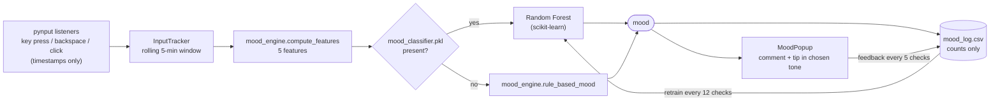

# EmotionMirror

**A privacy-first desktop companion that reads your work rhythm from typing and mouse *patterns*, never their content, and checks in with a friendly animated character.**

[](https://github.com/zxvozayy/EmotionMirror/actions/workflows/tests.yml)


---

## Demo

<!--
  Screenshots / GIFs go here. Suggested files (add them under docs/ and uncomment):

  <p align="center">
    
  </p>

  | Choose a companion | Mood check-in | Tray menu |
  |:---:|:---:|:---:|
  |  |  |  |
-->

*Screenshots coming soon.*

## Highlights

- **No camera, no microphone, no network.** The app counts key presses, backspaces and mouse clicks, and measures the timing between keystrokes. It never records which keys you type. The codebase makes no network requests at all.
- **Six work-rhythm states.** Every 5 minutes, the last 5 minutes of activity are classified as `idle`, `low_energy`, `deep_work`, `struggling`, `browsing` or `steady`.
- **Learns from your corrections.** Detection starts with transparent rules. After every 5 check-ins the app asks whether it guessed right, and every 12 check-ins it retrains a Random Forest on your corrections (once there are enough of them).
- **Companion with personality.** Two characters and three talking styles (Teacher, Best Friend, Love). Messages come from hand-written lines for each mood and are chosen without immediate repeats.
- **Tested core.** Feature extraction, classification rules, settings handling and the training pipeline are covered by a headless pytest suite in CI.

## How it works



**Features per 5-minute window**

| Feature | Meaning |
|---|---|
| `typing_speed` | Key presses (excluding backspace) |
| `mouse_activity` | Mouse clicks |
| `backspace_activity` | Backspace presses |
| `avg_keystroke_interval` | Mean gap between key presses, ignoring pauses of 2 s or more |
| `typing_rhythm_variance` | Variance of those gaps |

**Built-in rules** (used until a trained model exists; checked top to bottom, and `ratio` = backspaces / all key presses):

| Mood | Rule |
|---|---|
| `idle` | typing ≤ 15 and clicks ≤ 8 |
| `struggling` | ratio ≥ 0.20 and typing ≥ 170 |
| `deep_work` | typing ≥ 450, clicks ≤ 26 and ratio ≤ 0.15 |
| `browsing` | typing ≤ 120 and clicks ≥ 50 |
| `low_energy` | typing ≤ 80, clicks ≤ 20 and backspaces ≤ 12 |
| `steady` | anything else |

## Features

- **Floating companion** docked to the right edge of the screen. Click it to open a menu: *Check My Mood*, *I'm Feeling Better!*, *View/Take Notes*, toggle feedback, toggle sounds.
- **Mood check-ins** every 5 minutes, or on demand from the menu or the tray.
- **Feedback loop:** after every 5 check-ins, a dialog lets you correct the detected mood (can be switched off).
- **Self-training:** every 12 check-ins, the app retrains a 100-tree Random Forest on your most recent corrections (up to 800). It retrains only once there are at least 24 corrections and at least 5 for each mood present.
- **Quick notes** saved locally to `notes.txt`.
- **System tray:** show or hide the character, check mood, *Reset & Forget Me* (deletes settings, log, model and notes, then restarts), exit.
- **Polish:** intro video splash, first-run welcome and privacy dialog, pop-in and pop-out sound effects.

## Tech stack

| Layer | Technology |
|---|---|
| GUI | PyQt6 (widgets, animations, Qt Multimedia for the intro video) |
| Input signals | pynput (global keyboard and mouse listeners) |
| ML | scikit-learn `RandomForestClassifier`, pandas |
| Audio | pygame mixer |
| Tests / CI | pytest, GitHub Actions |

## Quickstart

**Prerequisites:** Python 3.10+. Developed and tested on Windows 10/11. pynput also supports macOS (grant Accessibility / Input Monitoring permission) and Linux on X11.

```bash
git clone https://github.com/zxvozayy/EmotionMirror.git
cd EmotionMirror

python -m venv .venv
# Windows: .venv\Scripts\activate    macOS/Linux: source .venv/bin/activate
pip install -r requirements.txt

python run_popup.py
```

On first launch you'll see a welcome screen, you'll be asked what the companion should call you, and then you pick a character and talking style. The app then lives in the system tray.

### Optional: train a model manually

The app retrains itself, but you can also train from the command line once `mood_log.csv` has at least 20 rows:

```bash
python train_ai.py                 # all logged rows (labels = the app's own predictions + your corrections)
python train_ai.py --labeled-only  # only rows you corrected (same as: python retrain_ai.py)
python predict_ai.py               # predict the mood of the latest logged window
```

## Configuration

No API keys or environment variables are needed. Everything is created locally, in the folder you run the app from, the first time it's needed:

| File | Contents |
|---|---|
| `settings.json` | Your display name, sound and feedback toggles, first-run flag (created with defaults if missing) |
| `mood_log.csv` | One row per check-in: timestamp, mood, the 5 numeric features, optional correction |
| `mood_classifier.pkl` | Trained model (only after training) |
| `notes.txt` | Your quick notes |

All four files are git-ignored. Timing constants (check interval, popup duration, feedback batch size) are in `Config` in [`run_popup.py`](run_popup.py).

## Testing

```bash
pip install pytest            # core suite is stdlib-only
pip install pandas scikit-learn   # optional: enables the training tests
python -m pytest
```

CI runs the suite headlessly on Python 3.10 and 3.12. No display, keyboard hooks or audio are required.

## Project structure

```text
EmotionMirror/
├── run_popup.py            # entry point: listeners, tray, timers, retraining
├── mood_engine.py          # pure logic: features, rules, settings, message picker
├── mood_popup.py           # animated companion popup, menu, notes, feedback
├── character_selection.py  # character and talking-style picker
├── train_ai.py             # CLI trainer (+ shared CSV loader)
├── retrain_ai.py           # train on feedback-corrected rows only
├── predict_ai.py           # predict the latest logged window
├── utils.py                # resource paths (source + PyInstaller)
├── resources/              # character art, sounds, intro video, icon
├── tests/                  # pytest suite
├── requirements.txt
└── .github/workflows/tests.yml
```

## Privacy

EmotionMirror is **100 % local**:

- It records **when** keys are pressed (and whether a key was Backspace), when the mouse is clicked, and coarse pointer samples that stay in memory. It never stores key identities, text, window titles, screenshots or files.
- In-memory events older than the 5-minute window are discarded.
- The only data written to disk are the files listed under [Configuration](#configuration), all inside the app folder.
- The code makes no network requests: no telemetry, analytics or cloud APIs.
- **Reset & Forget Me** in the tray menu deletes all of it.

## Roadmap

- [ ] Personal baselines: adapt rule thresholds to each user's typical pace.
- [ ] Store data in the OS app-data folder instead of the working directory.
- [ ] Optional daily summary chart of work-rhythm states.
- [ ] Packaged installer (PyInstaller) with auto-start on login.

## Author

**Hasan Özay Yılmaz** · GitHub [@zxvozayy](https://github.com/zxvozayy)

## License

Source available for portfolio review. All rights reserved. See [LICENSE](LICENSE).
